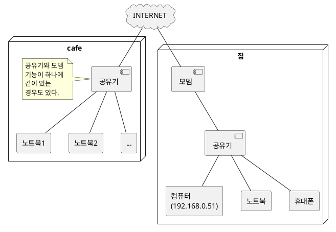
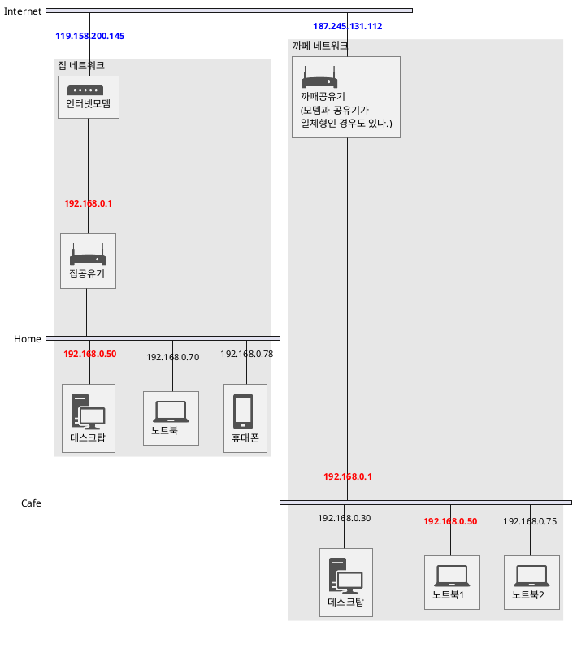
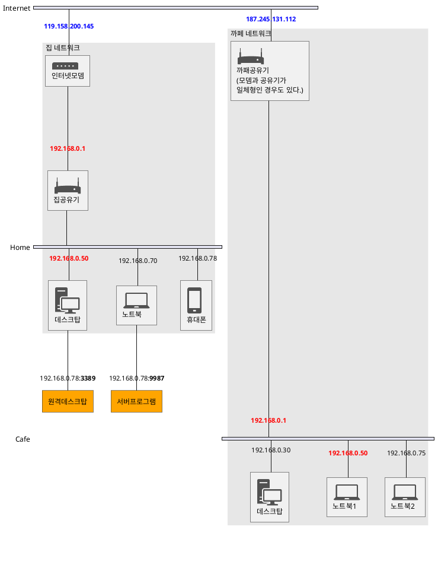
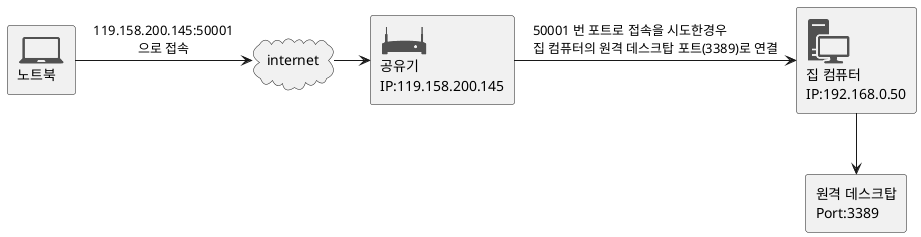
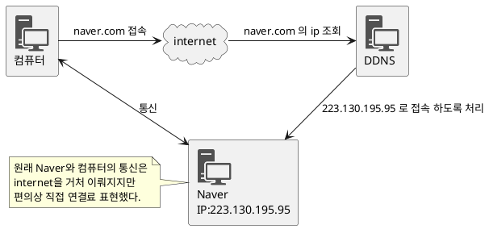

네트워크나 서버 프로그래밍, DB공부, 개인 파일서버나 원격접속등 외부에서 내 컴퓨터에 접근해야 할일은 상당히 많다. 만약 우리집에 있는 로컬컴퓨터에 원격 데스크탑이 가능하도록 세팅했다고 하자. 그리고 까패나 다른 곳에서 일이 생겨 내 컴퓨터에 원격으로 붙어야 할때 어떻게 하면 될까?

## 일단 그냥 한번 해보자 

원격 데스크탑 세팅이 가능한 사람이라면 CMD(명령프롬프트)창에서 **ipconfig** 명령을 이용해서 자신의 IP정도는 쉽게 확인 할 수 있을것이다. 만약 집이고 공유기를 이용해서 인터넷을 연결중이라면 노트북등 다른 컴퓨터에서 원격으로 붙는것도 손쉽게 가능할 것이다.

### 그런대 만약 다른곳에서 똑같이 한다면??

만약 까페의 인터넷 을 사용하거나 인터넷이 안되는 환경에서 휴대폰 테더링을 통해 인터넷을 하고 있는경우 위에서 한거처럼 똑같은 ip를 넣고 접속이 가능할까?? 당장 까페에 가서 테스트해보자. 굳이 까페에 가지 않더라도 노트북이 있다면 휴대폰 등으로 노트북을 테더링 연결 후 해보자. 

## 왜 안되는 걸까??

바깥에 까페등 다른곳에서 인터넷을 연결한 후 시도한다면 연결이 되지 않을것이다. 왜 안될까?? 아마 대부분 집과 까페에 인터넷을 연결하는 상황은 아래와 같을것이다.

이것을 도식화 하면 아래와 같다.

여기서 인터넷 망은 모뎀 혹은 공유기에 연결되며 PC나 휴대론은 공유기에 연결되서 인터넷에 연결된다. 여기서 집 모뎀과 카페 공유기는 각각 **카페 공유기 네트워크 망**, **집 공유기 네트워크 망** 으로 각각 독립된 네트워크다.(LAN 망이라고도 한다.) 

### 각각의 네트워크 망은 내부IP를 이용해서 통신한다.

위 그림에서 붉은색으로 표시된 IP는 집과 까페 네트워크에 중복해서 있는것을 볼 수 있다. 내부 내트워크 망에서서는 장비를 구분하기 위해 내부 IP주소를 사용하며 이 IP는 말그대로 내부 네트워크에서 사용되는 것이기 대문에 네트워크가 다르다면 중복가능하다. 즉 집과 까페에서 **192.168.0.50** ip 주소의 장비는 다른 장비다. 그렇기 때문에 집에서는 동작하는 원격이나 서버 접속이 다른곳에서 하면 안되는 것이다.

### 어?! 그럼 네이버에서 ip찾기한담에 그걸로 접속하면 되겠내요?

위에서 파란색으로 표시된 ip주소가 우리집 혹은 까페의 네트워크 IP주소이며 네이버에서 **내 ip확인** 등으로 확인할 수 있다. 그러면 "어?! 저주소로 접속하면 되는거 아냐??" 라고 생각할 수 있다. 하지만 위 도식을 보자. 푸른색 ip로 지정된 네트워크 밑에 컴퓨터 노트북 휴대폰등 여러장비가 연결되어 있다. 그럼 저 IP로 접속했을 때 어디로 접속해야 할까?? 모호해진다. 여기서 IP주소 이외에 포트(PORT) 라는 개념이 등장한다.

## PORT

위에서 IP주소로 네트워크에 접속한 장비 자체의 주소를 판단할 수 있다고 했다. 쉽게 포트는 네트워트에 접속한 장비에서 실행되는 프로그램에 접속할 수 있는 주소라고 보면 된다. 우리가 네트워크 를 통해 원격 데스크탑을 이용하는것을 예로 들어보자. 원격 데스크탑 역시 프로그램이다. 다른 장비에서 원격 데스크탑을 이용한다는 것은 다른 의미로 **어떤 장비(IP)에 실행중인 원격 데스크탑 프로그램에 접속**한다는 것을 의미한다. (원격도 하나의 프로그램이다.) 여기서 어떤 프로그램 을 구분할 수 있는 내용이 포트(PORT)다. 즉 어떤 장비(IP)의 어떤 프로그램(PORT) 에 접속 하는것. 그러면 위 도식은 아래와 같이 확장될 수 있다.

포트는 공유기 PC모두 각각 각 장비마다 0~65565 번까지 가질 수 있다. 여기서 0~49151 번은 이미 예약된 포트로 생각하면 되며 일반적인 경우 49152~65535 까지를 일반 유저가 사용하는것이 좋다.

## 먼가 외부에서 접속할 수 있는 방법이 보인다...

네트워크 망의 ip주소와 내부 ip에서 실행중인 프로그램을 구분까지 할 수 있게 되었다. 그러면 아래 방법으로 외부에서 노트북으로 집에 있는 내 컴퓨터에 원격접속할 수 있지 않을까?? 가능하다. 공유기의 기능중 공유기 ip의 특정 포트로 접속한 경우 내부 네트워크의 특정 포트로 연결하는 **포트 포워딩**이라는 기능을 이용하면 접속가능하다.

## 포트포워딩 세팅을 해보자

필자가 가지고 있는 공유기가 iptime 것이라 iptime을 기준으로 설명한다. 

### 공유기 설정 패이지 접속

우선 브라우저를 실행 후 주소에 **192.168.0.1** 을 입력해보자. 공유기 설정 패이지가 출력될 것이다. 공유기 설정 주소는 제조사 마다 다를 수 있기때문에 tplink 등 다른 공유기를 사용하고 있으면 설정 패이지에 들어가는 주소는 메뉴얼이나 검색해서 알아내도록 한다.

설정페이지에서 로그인 후 관리도구로 들어가면 위 그림과 같은 현제 공유기의 외부ip(붉은색 사각형 으로표시된 부분)등 공유기 현재 상태에대한 정보를 확인 할 수 있다. 외부ip의 경우 네이버등 포털에서 "내 ip 찾기"로 확인한 ip와 동일하다.

### 포트 포워딩 설정 항목 진입

공유기의 [NAT/라우터 관리] 항목에서 [포트포워드 설정] 항목으로 들어간다. 여기서 [새 규칙] 을 통해 포트포워드 규칙을 추가한다. 

* 규칙이름
  * 규칙이름은 내가 알기쉽게 정한다. 여기선 TEST_Remote_Outer라고 세팅한다.

* 내부 IP주소 
  * 포트포워딩을 통해 내가 접속하고자 하는 내부 장비의 IP를 지칭한다.
  * 위에서 확인한 컴퓨터 주소는 192.168.0.72 였다. 

* 외부 포트 / 내부포트
  * 외부포트 와 내부포트는 외부ip의 외부포트로 접속하면 이를 내부ip의 내부포트로 전환시키겠다는 의미다. 즉 현제 공유기 외부ip인 **210.2.43.119 의 50001 번 포트로 접속**하면 이를 내부ip **192.168.0.72 의 3389번 포트** 에 접속한것과 동일하게 처리하겠다 라는 의미이다.

규칙을 적용했으면 이제 테스트해보자

### 포트포워딩을 이용한 외부접속

아까와 같이 원격접속을 해본다. 하지만 이번엔 내부ip로 접속하는것이 아니라 아까 포트포워딩 세팅한 210.2.43.119:50001 로 접속해본다.

접속되는 것을 확인할 수 있다. 이주소는 외부 주소이므로 이 주소를 활용하면 외부에서도 우리집 네트워크에 접속하는게 가능하다.

### 과연 이걸로 끝난걸까..?

외부에서 접속할수 있지만 이방법은 몇가지 문제가 있다. 우선 

1. 어색한 ip주소를 외우고 있어야 한다. 
2. 이게 가장 큰 문제인대 일반 가정에서 사용하는 외부 ip는 계속 변경된다. ip는 한정적이기 때문에 인터넷 서비스업체(LG,KT,SK)에서는 할당되는 외부 IP를 수시로 갱신시키면서 미사용중인 ip를 정리하는등 ip가 불필요하게 낭비되지 않게한다.
3. 이때문에 나도 모르는 사이에 외부ip주소가 변경될 수 있고 그러면 역시 접속되던 것이 어느 순간 다시 안될 수 있다. 이경우 다시 외부ip를 확인하고 변경된 외부ip를 이용하는 수밖에 없다..

회사같은 경우 외부ip를 인터넷 서비스 업체에 돈을 주고 계속 해서 고정시키기도 하지만 일반 가정에서 그럴수는 없기때문에 이를 보완할 방법이 필요하다.

## DDNS

우리가 naver나 daum을 이용할 때 http://www.naver.com을 치고 들어가지 http://223.130.195.95를 치고 사이트에 접속하지는 않는다 이는 "naver.com" 이라는 문자열을 ip주소로 매칭시켜주기 때문인데 여기서 naver.com 을 도메인 이라고 하고 도메인을 ip로 변경해주는 곳을 도메인 네임 서버 라고 한다.

### 공유기 제조사에도 ddns 기능을 제공하는 곳이 있다. 

iptime, tplink등 커다란 공유기 회사는 자체 ddns기능을 지원한다. 이말인 즉슨 내 공유기의 도메인을 등록해 놓으면 네이버, 다음 처럼 도메인으로 우리집 네트워크에 접속할 수 있다는 것이고 ip가 변경되더라도 공유기 회사의 ddns기능을 통해 변경된 ip로 도메인이 자동으로 갱신되기 때문에 ip가 변경되는것에 대해 걱정하지 않아도 된다는 것이다(만세!)

### 공유기 ddns 세팅 

포트 포워딩과 마찬가지로 ddns세팅은 공유기 설정 패이지에서 할 수 있다. iptime기준 [특수기능]의 [DDNS 설정]에서 내 공유기의 도메인을 할당 받을 수 있다. 필자는 이미 등록했기 때문에 스크린 샷처럼 나오지만 DDNS등록 버튼을 통해 자신의 도메인을 세팅할 수 있다. 참고로 iptime의 경우 도메인 주소가 [호스트이름].iptime.org 으로 고정되니 참고할것.

### ddns 세팅은 공유기별로 저장된다

ddns 세팅은 공유기 별로 설정된다. 그렇기 때문에 공유기를 변경하는 경우 기존 공유기에서 사용하던 도메인 제거 후 변경된 공유기에 ddns세팅을 해야한다. 참고

### 도메인으로 접속해보자

이제 도메인으로 장비에 접속해보자. 도메인을 설정했을므로 이제 ip대신 도메인 이름을 넣고 원격으로 붙어보자. 

접속이 잘 되는 것을 확인할 수 있다. 이제 포트포워딩과 DDNS기능을 통해 외부에서도 우리집 홈 네트워크에 접속할 수 있을것이다.